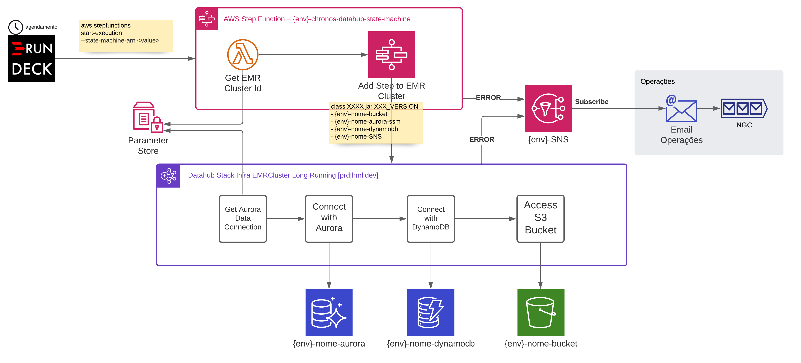

# example-aws-stepfunction-emr

Example for AWS Step Function, Lambda SSM Parameter Store, EMR and SNS



## Steps

1 - Create a S3 Bucket, referenced here by BUCKET.

2 - Upload the files to BUCKET:
- `artifacts/hello_world.py`
- `artifacts/install_libs.sh`

## LINUX

```bash
export AWS_PROFILE=<value>
```

Set the variables:

```bash
ENV=dev
BUCKET=<value>
EMAIL=<value>
```

Build, deploy and get outputs:

```bash
( aws cloudformation package --template-file template.yaml --output-template-file template_output_${ENV}.tmp --s3-bucket ${BUCKET} && aws cloudformation deploy --template-file template_output_${ENV}.tmp --stack-name cfstack-${ENV}-example-sfemr --capabilities CAPABILITY_IAM --parameter-overrides ArtifactsBucket=${BUCKET} EmailError=${EMAIL} && aws cloudformation describe-stacks --stack-name cfstack-${ENV}-example-sfemr | jq --compact-output '.Stacks[0].Outputs[] | [.OutputKey, .OutputValue]' )
```

Test the Step Function:

```bash
aws stepfunctions start-execution --state-machine-arn <value> --name <value> --input "{\"input1\":\"value1\",\"input2\":\"value2\"}"
```

## WINDOWS

```bash
set AWS_PROFILE=<value>
```

```bash
set ENV=dev
set BUCKET=<value>
set EMAIL=<value>
```

```bash
aws cloudformation package --template-file template.yaml --output-template-file template_output_%ENV%.tmp --s3-bucket %BUCKET%
```

```bash
aws cloudformation deploy --template-file template_output_%ENV%.tmp --stack-name cfstack-%ENV%-example-sfemr --capabilities CAPABILITY_IAM --parameter-overrides ArtifactsBucket=%BUCKET% EmailError=%EMAIL%
```
